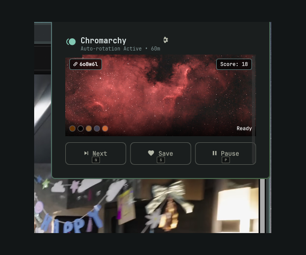

# 󰬸 Chromarchy

**Theme-Aware Wallhaven Wallpaper Rotator & Color Matcher for Omarchy**

Chromarchy is an intelligent wallpaper management and rotation plugin for the [Omarchy](https://github.com/basecamp/omarchy) desktop environment. It dynamically harmonizes your desktop background with your active Omarchy color scheme by searching [Wallhaven](https://wallhaven.cc) for wallpapers that mathematically match your palette.

Whether you switch themes on the fly, want complementary contrast hues, desire automated timed rotation with background pre-fetching, or want strict control over color harmony thresholds, Chromarchy delivers a stutter-free, deeply integrated experience.



---

## ✨ Key Features

- **🎨 Theme-Aware Color Harmony**
  - Extracts active theme tokens (`accent`, `background`, `selection`, standard, and bright colors) directly from `~/.local/state/omarchy/current/theme/colors.toml`.
  - Converts hex codes to CIE L\*a\*b\* space and maps them to the nearest Wallhaven 29-color search palette using Euclidean distance.
  - Scores candidate wallpapers using CIE76 Delta-E ($\Delta E$) distance across multiple theme colors with multi-match reward weighting.

- **📊 Harmony Score Threshold & Deep Candidate Pooling**
  - Set a maximum acceptable harmony score threshold (`Off`, `≤ 15`, `≤ 25`, `≤ 35`, `≤ 50`) to keep only wallpapers with strict color alignment.
  - **Multi-Page Candidate Pooling:** If the first page of Wallhaven results does not meet strict score criteria, Chromarchy automatically searches deeper (up to 5 pages) and aggregates all candidates into a unified pool.
  - **Graceful Fallback:** If all candidate pages exceed a strict threshold, the filter automatically relaxes to select the absolute best-matching wallpaper found across all searched pages.
  - Interactive score badge with hover tooltip explaining Delta-E scoring tiers:
    - `< 20`: **Excellent** match (near-seamless theme blend)
    - `20 – 35`: **Good** match (harmonious accents)
    - `> 35`: **Moderate** match (creative contrast)

- **🎛️ Dual-View Architecture & Ranked Color Palette**
  - **Main View:** Clean wallpaper preview card with resolution badge, Wallhaven ID badge, Delta-E score badge with hover explanation, active search keyword chip, and quick-action buttons.
  - **Settings View:** Dedicated configuration screen toggled via the settings gear icon (`󰒓`) in the top-right header.
  - **Ranked Color Palette:** Visual grid of active theme swatches showing numeric rank badges (`#1`, `#2`, `#3`...).
    - **Left-Click:** Toggle inclusion and rank position.
    - **Right-Click:** Instantly promote any color to the **#1 Primary API Search Color**.

- **🌈 Three Dynamic Color Modes**
  - **Matching:** Queries Wallhaven using your active theme colors directly.
  - **Complementary:** Computes 180° opposite hues on the color wheel for striking, vibrant contrast.
  - **Surprise Me:** Randomly alternates between matching and complementary palettes per rotation.

- **⌨️ Keyboard Shortcuts with In-Button Keycap Badges**
  - In-button keycap badges styled in the system's Nerd Font:
    - **`N` / `n`:** Next wallpaper.
    - **`S` / `s`:** Save current wallpaper.
    - **`P` / `p`:** Pause or resume rotation timer.
    - **`R` / `r`:** Refresh and fetch a new batch immediately.
    - **`O` / `o`:** Open the current wallpaper directly on Wallhaven in your default browser.
    - **`Esc`:** Close the popup panel.
    - **`←` / `→`:** Step through previously cached wallpapers.

- **⚡ Background Pre-Fetch & Live Rotation**
  - **Pre-fetch Mode (Default):** Downloads batches of wallpapers in the background and downscales them to display resolution using ImageMagick for instantaneous wallpaper switching.
  - **Live Mode:** Fetches freshly matched wallpapers on every rotation interval.
  - Automatic rate-limiting protection with sliding-window request throttling to respect Wallhaven's 45 req/min quota.

- **💾 Dual Save Behaviors**
  - **Save & Rotate:** Saves favorite wallpapers to `~/.config/omarchy/backgrounds/<theme>/`, immediately adding them to Omarchy's native `SUPER+CTRL+SPACE` wallpaper rotation.
  - **Save Only:** Archives wallpapers to `~/.config/omarchy/saved-wallpapers/<theme>/` without cluttering the active rotation pool.

- **🖥️ Multi-Monitor Support**
  - **Same on All:** Synchronized wallpaper across all connected displays.
  - **Different per Display:** Pulls distinct, harmonized wallpapers for each connected display output.

---

## 📂 Architecture & Directory Structure

Chromarchy installs directly into your Omarchy plugins directory:

```
~/.config/omarchy/plugins/io.rendarth.chromarchy/
├── manifest.json            # Plugin manifest and configuration schema
├── BarWidget.qml            # Status bar item with icon, tooltip, and mouse routing
├── Panel.qml                # Layer-shell popup panel (Main & Settings views)
├── CacheManager.qml         # State engine: cache, timers, rotation, history, deep search pool
├── WallhavenApi.qml         # Asynchronous HTTP client for Wallhaven REST API & rate limiting
├── ColorUtils.qml           # Palette conversion, CIE L*a*b* math, complementary calculation
├── scripts/
│   ├── color_math.py        # Python engine for RGB -> L*a*b* and Delta-E scoring
│   ├── detect-resolution.sh # Hyprland / wlr-randr monitor resolution detector
│   ├── download-wallpaper.sh# Wallpaper downloader with optional ImageMagick downscaling
│   ├── fetch-wallpapers.sh  # Wallhaven API curl query wrapper with rate-limit handling
│   ├── get-theme-colors.sh  # Wrapper for omarchy-theme-color extraction
│   ├── save-wallpaper.sh    # Hardlink/copy helper with path sanitization
│   ├── score_wallpapers.py  # Standalone Python candidate ranking utility
│   ├── score-wallpapers.sh  # Bash wrapper for wallpaper candidate ranking
│   └── test_backend.sh      # Automated unit and integration test suite
├── LICENSE                  # MIT License
├── preview.png              # Marketplace preview asset
└── README.md                # Documentation
```

---

## 🚀 Installation & Setup

### 1. Prerequisites

Chromarchy requires standard Omarchy runtime dependencies:
- **Bash**, **curl**, and **python3** (standard on Arch Linux / Omarchy).
- **ImageMagick** (`magick` or `convert`) — *recommended* for downscaling high-resolution images to match monitor geometry.
- **Hyprland** (`hyprctl`) or **wlr-randr** — for automatic display resolution detection.

### 2. Installation

Install and enable Chromarchy via the Omarchy CLI:

```bash
omarchy plugin add https://github.com/rendarth/chromarchy.git --enable
```

Or manually place into your Omarchy bar layout in `~/.config/omarchy/shell.json`:

```json
{
  "bar": {
    "sections": {
      "right": [
        {
          "id": "io.rendarth.chromarchy",
          "colorMode": "matching",
          "colorKeys": ["accent", "background"],
          "keywords": "",
          "category": "general",
          "purity": "sfw",
          "fetchMode": "prefetch",
          "prefetchCount": 10,
          "interval": 1800,
          "maxScore": 0,
          "multiMonitor": "same",
          "saveBehavior": "rotate",
          "allowDuplicates": false
        }
      ]
    }
  }
}
```

Reload your Omarchy shell (`SUPER+CTRL+R` or `omarchy restart shell`) to activate the widget.

### 3. Placing the Widget (Left, Center, or Right)

Chromarchy supports placement in any section of the Omarchy bar (`left`, `center`, or `right`). The popup panel dynamically anchors directly underneath the icon in its active section.

- **Via the Settings UI:** Open the Settings view (`󰒓` icon in header), locate **BAR PLACEMENT**, and click **Left**, **Center**, or **Right**. The widget moves immediately.
- **Via the CLI:**
  ```bash
  # Move widget section
  omarchy bar move io.rendarth.chromarchy --section left
  omarchy bar move io.rendarth.chromarchy --section center
  omarchy bar move io.rendarth.chromarchy --section right
  ```

### 4. Removal

```bash
omarchy plugin remove io.rendarth.chromarchy
```

---

## ⚙️ Configuration Reference

All settings can be adjusted in real time via the interactive Settings view in the panel, or declared in `shell.json`:

| Key | Type | Default | Options | Description |
| :--- | :--- | :--- | :--- | :--- |
| `colorMode` | `string` | `"matching"` | `"matching"`, `"complementary"`, `"surprise"` | Strategy used to match Wallhaven results against theme colors. |
| `colorKeys` | `array` | `["accent", "background"]` | Array of theme color keys | Selected theme colors. Position `#1` is the primary Wallhaven API search query. |
| `maxScore` | `number` | `0` | `0` (Off), `15`, `25`, `35`, `50` | Maximum Delta-E harmony score limit. Excludes wallpapers scoring above this threshold. |
| `keywords` | `string` | `""` | Free text | Search keywords (e.g. `minimal`, `nature`, `cyberpunk`, `space`). |
| `category` | `string` | `"general"` | `"general"`, `"anime"`, `"people"`, `"general+anime"`, `"all"` | Wallhaven category filter. |
| `purity` | `string` | `"sfw"` | `"sfw"`, `"sketchy"`, `"sfw+sketchy"`, `"all"` | Content purity filter. |
| `fetchMode` | `string` | `"prefetch"` | `"prefetch"`, `"live"` | `prefetch` caches a batch in background; `live` downloads on each rotation. |
| `prefetchCount`| `number`| `10` | `1` to `20` | Number of wallpapers downloaded in advance when in `prefetch` mode. |
| `interval` | `number` | `1800` | `300` (5m) to `14400` (4h) | Seconds between wallpaper rotations. |
| `multiMonitor` | `string` | `"same"` | `"same"`, `"different"` | Synchronized or per-display distinct wallpapers. |
| `saveBehavior` | `string` | `"rotate"` | `"rotate"`, `"save-only"` | Target directory (`backgrounds/<theme>` vs `saved-wallpapers/<theme>`). |
| `allowDuplicates`| `boolean`| `false` | `true`, `false` | When `false`, tracks seen wallpapers in history to prevent repetition. |

---

## 🎮 Controls & Shortcuts

### Status Bar Actions
- **🖱️ Left Click:** Open / close popup panel.
- **🖱️ Middle Click:** Immediately skip to the next wallpaper.
- **🖱️ Right Click:** Save the current wallpaper.

### Popup Keyboard Shortcuts
When the popup panel is open:
- **`N` / `n`:** Next wallpaper.
- **`S` / `s`:** Save current wallpaper.
- **`P` / `p`:** Pause / resume rotation.
- **`R` / `r`:** Refresh / fetch new batch immediately.
- **`O` / `o`:** Open active wallpaper on Wallhaven in browser.
- **`←` / `→`:** Navigate previous / next wallpaper in batch.
- **`Esc`:** Dismiss panel.

### Ranked Color Palette
- **Left-Click Swatch:** Toggle inclusion in scoring palette.
- **Right-Click Swatch:** Promote color to the **#1 Primary Search Color**.

---

## 🔒 Security & Safe Coding Practices

Chromarchy is built with security and reliability principles:

1. **Zero Hardcoded Secrets & Credentials:**
   - No API keys, passwords, tokens, or personal paths are stored anywhere in the codebase.
   - Operates entirely on Wallhaven's public unauthenticated API without requiring user accounts or external secrets.

2. **Injection-Safe Command Execution:**
   - All backend script calls from QML use Quickshell `Process` with structured argument arrays (e.g. `["bash", script, "--flag", value]`).
   - Arguments are dispatched directly via `execve` without passing concatenated shell strings, eliminating shell command injection vulnerabilities.

3. **Strict URL Scheme Validation:**
   - External browser navigation strictly validates URLs using regex (`^https://wallhaven\.cc/w/[a-zA-Z0-9]+$`).
   - Disallows arbitrary or unsafe URL schemes (`file://`, `javascript:`, `data:`, etc.) from being opened.

4. **Path Traversal Protection:**
   - Theme names and filenames are sanitized (`basename` extraction and strict alphanumeric/dash slug filtering) to prevent path traversal outside designated XDG directories.
   - Wallpapers are strictly saved within `${XDG_CONFIG_HOME:-$HOME/.config}/omarchy/` and cached within `${XDG_CACHE_HOME:-$HOME/.cache}/chromarchy/`.

5. **Atomic Caching & Corruption Prevention:**
   - State files (`history.json`, `current_batch.json`) use `atomicWrites: true` to prevent file corruption during power interruptions or rapid switches.

---

## 📡 Quickshell IPC & Keybindings

You can trigger Chromarchy actions from external scripts or Hyprland keybindings:

```bash
# Skip to next wallpaper
quickshell ipc call chromarchy next

# Save current wallpaper
quickshell ipc call chromarchy save

# Pause / Resume rotation
quickshell ipc call chromarchy pause
quickshell ipc call chromarchy resume

# Toggle popup panel
quickshell ipc call chromarchy toggle
```

### Adding a Hyprland Shortcut (`~/.config/hypr/hyprland.conf`)
```ini
bind = SUPER ALT, W, exec, quickshell ipc call chromarchy next
bind = SUPER ALT, S, exec, quickshell ipc call chromarchy save
```

---

## 🧪 Testing

Run the automated backend test suite:

```bash
~/.config/omarchy/plugins/io.rendarth.chromarchy/scripts/test_backend.sh
```

---

## 📄 License

Distributed under the MIT License. Built with ❤️ for the Omarchy community.
